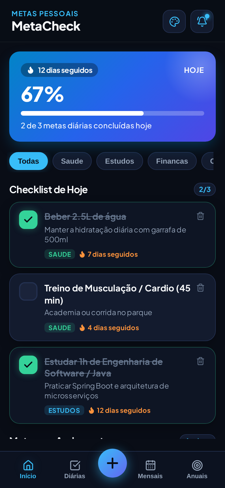
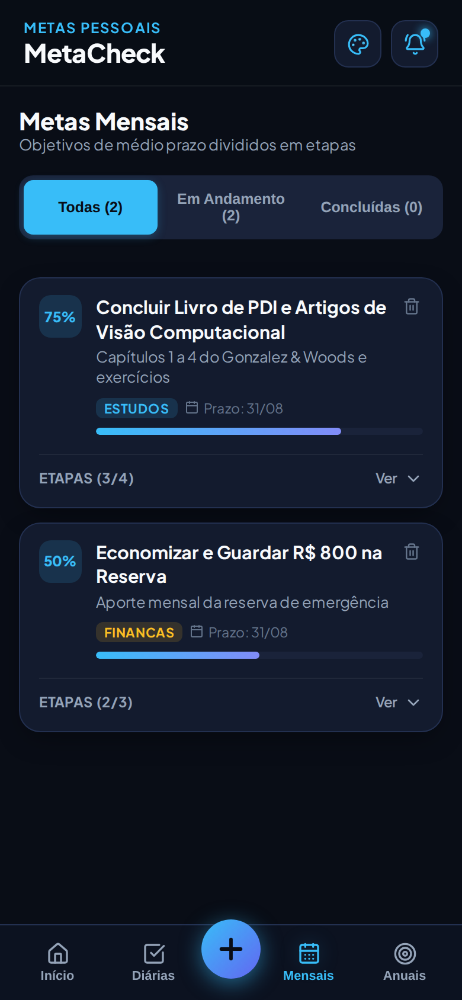

# MetaCheck

App de metas e hábitos para Android e web. Separa o que é do dia (hábitos com sequência de dias), do mês (objetivos quebrados em etapas) e do ano, e lembra na hora certa com notificação local — sem conta, sem servidor, tudo fica no aparelho.

**[Abrir versão web](https://mvitorls.github.io/checklist-de-metas/)** · **[Baixar APK (v1.3.2)](https://github.com/MvitorLS/checklist-de-metas/releases/latest)** · [Changelog](./CHANGELOG.md)

<p align="center">
  
  &nbsp;&nbsp;
  
</p>

## Funcionalidades

- **Três horizontes**: diárias (check-off + contagem de dias seguidos), mensais (etapas com progresso 0–100%) e anuais (com prazo).
- **Lembretes nativos no Android** via `@capacitor/local-notifications`: resumo de manhã, revisão à noite com o que ficou pendente e alarme individual por meta. Os agendamentos usam `allowWhileIdle` + `SCHEDULE_EXACT_ALARM` para disparar no horário mesmo com o aparelho em repouso, num canal de prioridade alta (aparece como pop-up e toca som).
- **5 temas** trocados em tempo real por CSS custom properties.
- **Backup**: exporta/importa tudo em JSON e exporta relatório em CSV.
- **Offline**: estado em `localStorage`, gerenciado por um `Context` do React (`src/context/MetasContext.tsx`).

## Estrutura

```
src/
├── context/MetasContext.tsx        # estado global + persistência
├── services/notificationService.ts # permissões, canal Android e agendamentos
├── screens/                        # Dashboard, Diárias, Mensais, Anuais
├── components/                     # cards, modais de nova meta/config/notificações
└── types/meta.ts
android/                            # projeto nativo gerado pelo Capacitor
```

## Rodando

```bash
npm install
npm run dev              # web em http://localhost:5174

npm run build
npx cap sync android     # copia o build para o projeto Android
npx cap open android     # abre no Android Studio para gerar o APK
```

O deploy da versão web é feito pelo GitHub Actions (`.github/workflows/deploy-pages.yml`) a cada push na `main`.

## Stack

React 19 · TypeScript · Vite · Capacitor 7 · Lucide · canvas-confetti

## Próximos passos

- [ ] Testes para o cálculo de sequência e de progresso
- [ ] Sincronização opcional entre aparelhos
